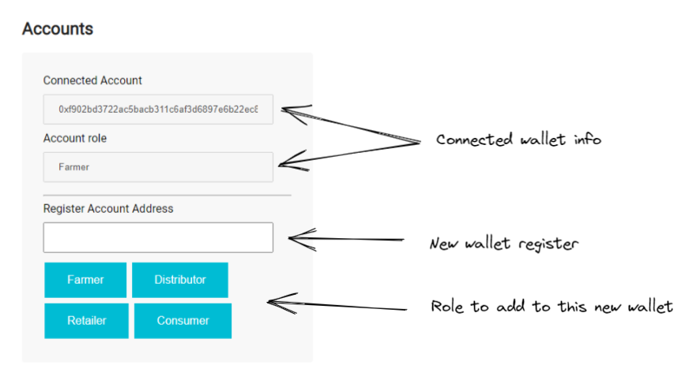
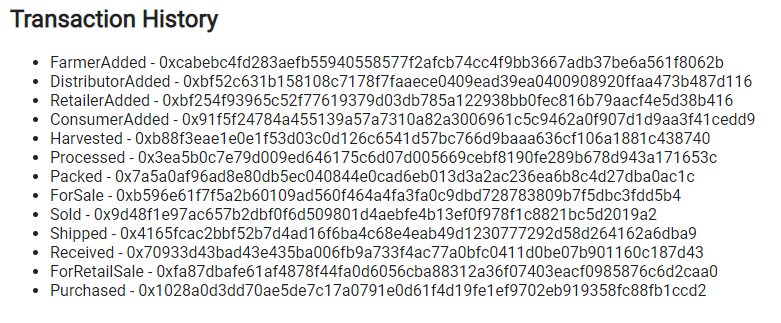

# Ethereum Dapp for Tracking Items through Supply Chain

Rinkeby Contract Address: 0x0b78158561dc450039469C2142A1AE7b70E9326F

Rinkeby Transaction ID: 0xfdd8fcd8dbf978e11e3caae64c15e957f9d6fe7cc6451d3954e76d6006a75116

Program version numbers:
- node version number: v16.13.2
- ganache-cli version number: v6.12.2
- Truffle version number: v5.5.25
- web3 version number v1.7.4

## Libraries

- lite-server@2.4.0: already included in the boilerplate, is a lightweight webserver
- truffle-hdwallet-provider@1.0.17: to publish the contract in Rinkeby Network, I installed     

## Key changes to the boilerplate

As you'll see in the UML's, by the end of this document, I noticed that when consumers purchased they were not charged. I assume the retailer would want to set his price in the product and the consumer should pay that to receive the coffee. To maintain transparency, I decided to keep the product price as is and include a new property retailProductPrice.

I also didn't understand how to use the dApp, and there was no description about it. So I created a flow that made sense to me: the owner needs to manage the accounts, adding the farmers, distributors, retailers and consumers.



The product overview, as I understand, should be fetched by UPC only. So I changed the other fields to disabled. I also included all missing fields and merged the two buttons into one, so the user don't have to bother.

And instead of fetching item details only when clicking the Fetch Data buttons, I am fetching the data every time a change occurs, just for convenience.


The forms were separated by role. And contains info and only the buttons that role can fire.

As mentioned earlier, the retailer role has the ability to change retail price and an action to put up a coffee for sale.


On the bottom of the page, the transaction history was kept.



## Getting Started

Clone this repository:
```
git clone https://github.com/udacity/nd1309/tree/master/course-5/project-6
```

Change directory to project-6 folder and install all requisite npm packages (as listed in package.json):
```
cd project-6
npm install
```

Launch Ganache:
```
ganache-cli -m "spirit supply whale amount human item harsh scare congress discover talent hamster"
```

Your terminal should look something like this:


In a separate terminal window, Compile smart contracts:

```
cd project-6
truffle compile
```

Your terminal should look something like this:


This will create the smart contract artifacts in folder `project-6\build\contracts`.

Migrate smart contracts to the locally running blockchain, ganache-cli:

```
truffle migrate
```

By the end, your terminal should show that 6 contracts were deployed:


Test smart contracts:

```
truffle test
```

All 11 tests should pass.


In a separate terminal window, launch the DApp:

```
cd project-6
npm run dev
```

## UMLs


